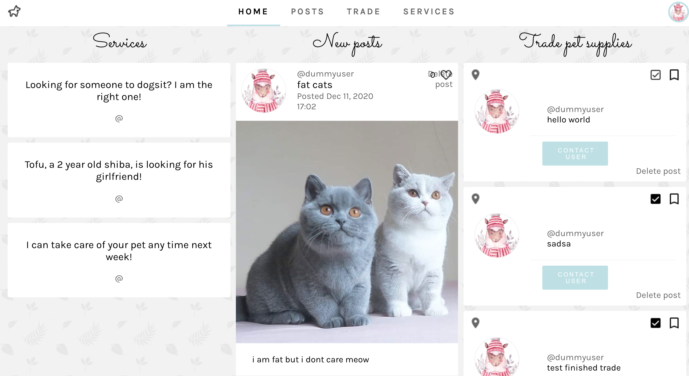
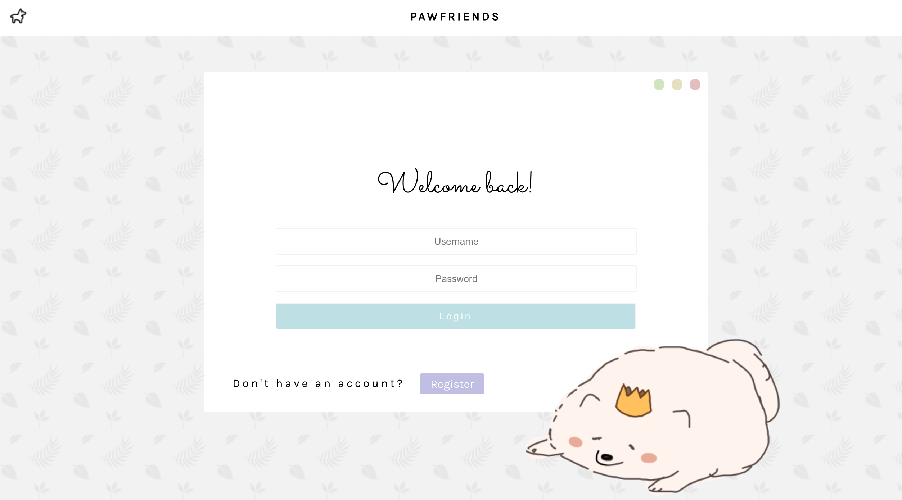
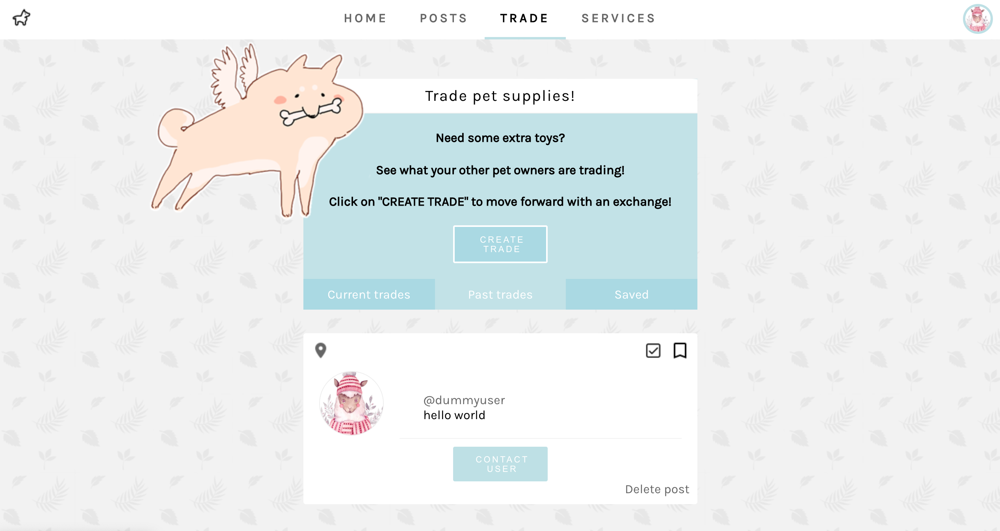

# Pawfriends
This was done for a course project at the University of Toronto (CSC309 - Programming on the Web) with 3 other team members. We were asked to use minimal libraries, and instead use as much plain HTML/CSS/Javascript as we could to demonstrate our understanding of web programming.

### Deployed webpage link: https://pawfriend.herokuapp.com/

&nbsp;

# Features of Pawfriends

The features of our web appliction includes creating posts for your pet, viewing the toys post from other people and creating a trade post, and viewing a list of people for matchmaking pets and pet daycare and making a post for daycare/matchmaking. The main page shows the aggregate of features for the website.

# User Journeys

## User Journey of Pawfriends - I. Main page

0. After you navigate to the heroke wep page, you would be able to see a login page.
1. You can check functionalities as an user or as an admin.
2. For ease, we will provide you the credentials admin(ID) - admin(password) and user(ID) - user(password) for checking functionalities. However, we do have a page for login and a page for creating login credentials that are directed from the main page's `Register` button.
3. You will be able to see three different sections: Posts, Trades, and Services. You can navigate to each section by clicking this header.
4. The main page works like Newsfeed; if you click the content in either of Services, New Posts, Trade Pet Supplies, you will be directed to the corresponding section.

## User Journey of Pawfriends - II. Regular User

0. Enter `user` for ID and `user` for password.
1. If you want to see the posts created by you, click `Post`. You can view previous posts, like a post, leave comments on the post (new feature), make a new post, or delete the post (new feature). Clicking any user's name or profile picture will redirect to their profile (new feature). Before deletion, when you click the button to delete the post, you will be asked to confirm if you actually want to delete the post (new feature).
2. If you want to see the posts for trades, click `Trade`. You can view previous trade posts and create a new trade. You can contact the poster to initiate the trade (new feature). To create a new trade post, click "CREATE TRADE". You can explore current trades or previous trades by clicking corresponding button(new feature). Also, you can delete the trade if you are the poster of the trade. The services section provide sorting functionality (new feature). You can filter posts by userID or tags, which creates a better view tailored to your or your pet's needs. For each posting of Services section, you can click the name of the poster to see what the poster is like, as this section is mainly intended for actual meetups that would leave a larger impact on you or your pets, such as matchmaking or pet daycare, compared to trading pet supplies. If you click contact info, it would give you the original poster's phone number and email so that you could contact the person to arrange a meetup for offering or receiving services (new feature).
3. Click the profile icon in the top right of the navigation bar to open a dropdown menu which links to 'Profile', 'Settings', and 'Logout' pages.
4. In Profile, you can modify your status and view your profile information. Click the tabs to navigate between user info, your pets, and friends list. You can add or delete friends and pets in this section (new feature). For pets, deletion is also possible by clicking the red button on the top.
5. In Setting, you can edit your own personal information in profile section and account information in the account section
6. In the pets section, you can view your pet's about me section and edit it (new feature).

## User Journey of Pawfriends - III. Admin User

0. Enter `admin` for ID and `admin` for password.
1. You will be able to see the general statistics of our website such as the number of regular users, admin users, and posts.
2. You can manage regular site users by viewing their profile info or deleting a user's account.
3. You can explore the admin dashboard for user management. (New Feature)

&nbsp;

&nbsp;

# Technical details
## Steps for local development environment setup

0. Have `npm` installed
1. Open a terminal shell and navigate to the root directory of this repo
2. Run `npm run setup` to install all dependencies
3. Make sure a the Mongo database service is running
4. Run `npm run build-run` to build the React app and start the Node server (to run the React development server, navigate to the `pawfriends` subdirectory and run `npm run start`)
5. Open the generated link in a browser (default local development link: http://localhost:5000/)
6. 
## Overview of the backend routes

- `POST /posts` : Create a post
  - Expects request to have nonempty string properties `title` and `content`, and optionally have an image uploaded by the form.
- `GET /posts/:postId` : Gets the post with postId
- `GET /posts` : Gets array of all posts created on the system
- `DELETE /posts/:postId` Delete the post with `postId`
- `GET /services` Gets array of all services in the DB
- `GET /trades` Gets array of all trades in the DB

Responses for posts, trades, and services have an "owner" property that represents the user who created the post/trade/service listing; the "owner" object has the following format:
`{ "_id": the owner's, "username": user's username, "actualName": user's real name, "avatar": { "image_id": the cloudinary public image id "image_url": the cloudinary image url } }`

- `POST /users/login` Route expects a JSON with the following parameters \
   { \
   username: "username example", \
   password: "pw example",\
   actualName: "alex john",\
   gender: "Male",\
   birthday: "April 7 1888",\
  } \
  Creates a user for this webapp and returns a JSON with this format `{ currentUser: user.username }`

- `POST /users/login`Route expects a JSON with the following parameters \
   { \
   username: "username example", \
   password: "pw example",\
  } \
  Logs in a user for this webapp and returns a JSON with this format `{ currentUser: user.username }`

### Libraries/Frameworks used: React, Node, Express, Mongodb, Mongoose, connect-multiparty, cloudinary
