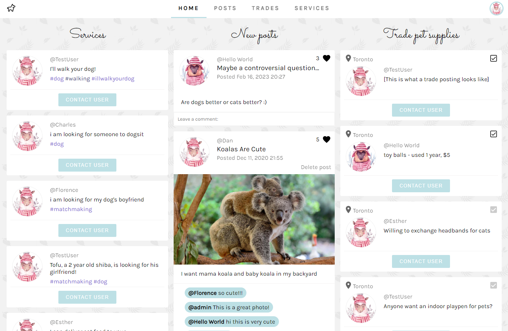
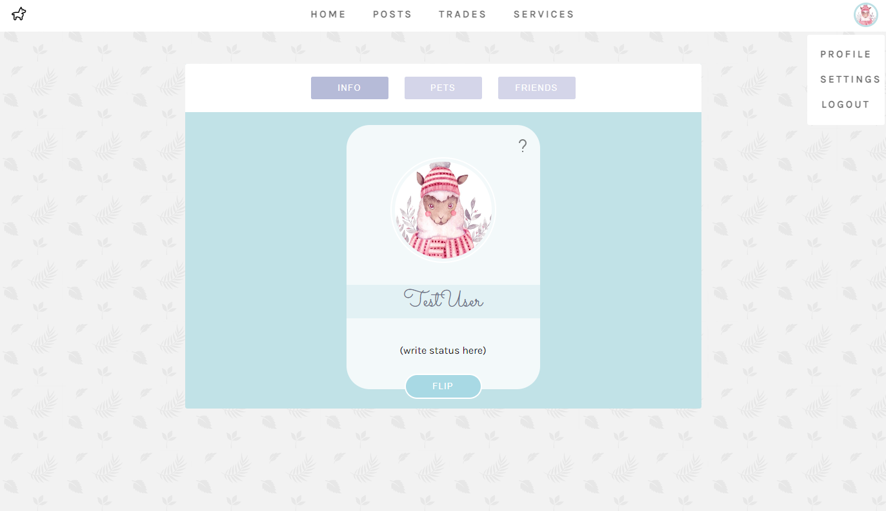
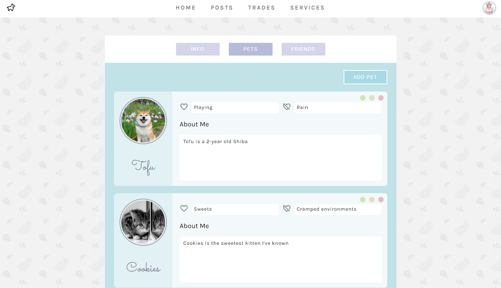

# Pawfriends

This was done for a course project at the University of Toronto (CSC309 - Programming on the Web) with 3 other team members. We were asked to use minimal libraries, and instead use as much plain HTML/CSS/Javascript as we could to demonstrate our understanding of web programming.

I was in charge of most of the database and backend routes features, as well as the Posts page and components on the frontend.

<!-- ### Deployed webpage link: https://pawfriend.herokuapp.com/ -->



&nbsp;

# Description of Pawfriends Features

The features of our web application includes creating and viewing posts relates to pets, creating and viewing posts for trading pet supplies, and creating and viewing postings for pet-related services such as matchmaking pets and pet daycare. The main page shows the aggregate of features for the website.

Users may adjust their profile information and account details, as well as record their pet information under their profile.

# User Journeys


## User Journey of Pawfriends - I. Main page

0. After you navigate to the website landing page, you will see a login page (when not logged in).
1. Users may login with their credentials, or register for an account by clicking on the `Register` button.
   For ease, we have set up a sample account with username `cususer1` and password `cususer1`.
2. After registering or logging in, you will be redirected to the main page, which shows three different sections: Posts, Trades, and Services. You can navigate to each section by clicking this header.
3. The main page shows all content for easy viewing at a glance.
4. Log out by clicking on the profile icon at the top right of the page and then clicking on the `Logout` button revealed by the dropdown menu.
<!-- 4. The main page works like Newsfeed; if you click the content in either of Services, New Posts, Trade Pet Supplies, you will be directed to the corresponding section. -->


## User Journey of Pawfriends - II. Regular User

0. Log in by using `user` for username and `user` for password.

1. Posts: Click on `Posts` (navigation bar at the top of window) to see posts created by you and others on the site. You can:

   - View previous posts.
   - Like/unlike a post by clicking the heart button (top right of a post).
   - Leave comments on a post (the "Leave a comment" section at the bottom of a post).
   - Create a new post (section at the top of the page). Posts contain a title, message, and optionally an image.
   - Delete one of your posts ("Delete post" button). Before deletion, when you click the button to delete the post, you will be asked to confirm whether you actually want to delete the post.
   <p>&nbsp;</p>


2. Trades: Click on `Trades` (navigation bar at the top of window) to see postings for trades. You can:

   - View trade postings, including current trade offers, past trades, and trade postings made by you.
   - Contact the poster to initiate the trade, through the contact information revealed by clicking the "Contact User" button.
   - Mark a trade as complete by clicking the check button (top right of a posting). Completed traded will have a greyed-out checked box.
   - Create a new trade posting by clicking on "Create Trade" (section at the top of the page).
   - Delete a trade posting if you posted it.
   <p>&nbsp;</p>


3. Services: Click on `Services` (navigation bar at the top of window) to see postings for services.

   - View service postings, and filter postings through usernames and tags for postings more relevant to your or your pet(s)' needs. Text to filter by is not case sensitive and can appear anywhere in the relevant field.
   - Click on the name or profile picture of the poster to view their profile and see what the poster is like, as this section is mainly intended for actual meetups that would leave a larger impact on you or your pets, such as matchmaking or pet daycare.
   - Contact the poster for more information and arrange further details, through the contact information revealed by clicking the "Contact User" button.
   <p>&nbsp;</p>


4. User profiles: Throughout the `Home`, `Posts`, `Trades`, and `Services` pages, clicking any user's name or profile picture will redirect to their profile. On a profile page, click the tabs to navigate between the sections:

   - The "Info" tab contains their personal information
   - The "Pets" tab contains information about their pets, if they have any
   - The "Friends" tab contains the friends they follow
   - For users other than yourself, you have the option to add/remove them as a friend you follow through the "Add Friend"/"Remove Friend" button at the top-right of the profile box(only the relevant option will be displayed, based on whether the user is already a friend you are following).
   <p>&nbsp;</p>



5. Click the profile icon in the top right of the navigation bar at the top of the page to open a dropdown menu which links to the `Profile` and `Settings` pages, as well as the ability to `Logout`.


6. In `Profile`, you see a similar view to the profiles of other user, except you can use it to modify your profile information and information about your pets. Editable fields on this page autosave your changes.

   - On the "Info" tab, you can update your status in the field under your username
   - On the "Pets" tab, you can view, edit, and delete your pet information. Create a pet by clicking on the "Add Pet" button and filling out the form. Edit your pet(s)' name, likes, dislikes, and description. Delete a pet by clicking the red button at the upper-right corner of a pet section.
   <p>&nbsp;</p>



7. In `Settings`, you can edit your own personal information in the "User Profile" section and account information (such as change password) in the "Account" section.


<!-- ## User Journey of Pawfriends - III. Admin User

0. Enter `admin` for ID and `admin` for password.
1. You will be able to see the general statistics of our website such as the number of regular users, admin users, and posts.
2. You can manage regular site users by viewing their profile info or deleting a user's account.
3. You can explore the admin dashboard for user management. -->

&nbsp;

&nbsp;

# Technical details

## Steps for local development environment setup

0. Have `node` and `npm` installed
1. Open a terminal shell and navigate to the root directory of this repo
2. Run `npm run setup` to install all dependencies
3. Make sure a Mongo database service is running, and supply it through the
   environment variable `MONGODB_URI`
   (default local development: `mongodb://localhost:27017/Pawfriends` )
4. Create other environment variables
   (Note: you can save these in a `.env` file in the root directory, and load
   them by changing the server start call to `node -r dotenv/config server.js`
   in `package.json`)
   - `EXPRESS_SESSION_SECRET`: a random string to act as Express's session secret
   - `CLOUDINARY_API_SECRET`: API secret for Cloudinary image service
5. Run `npm run build-run` to build the React app and start the Node server
   (to run the React development server, navigate to the `pawfriends`
   subdirectory and run `npm run start`)
6. Open the generated link in a browser
   (default local development link: `http://localhost:5000`)

&nbsp;

## Overview of the backend routes

### User account creation

- `POST /users` : Create a new user with the given information.
  - Usernames must be nonempty alphanumeric strings, while passwords must be longer than 4 characters.

### Login and user session related

- `POST /users/login` : Route expects a JSON with the following parameters

  ```
  {
      username: "username example",  // must be alphanumeric
      password: "pw example",        // minimum of 4 characters
      actualName: "alex john",
      gender: "Male",                // one of "Secret," "Male," "Female"
      birthday: "April 7 1888",
  }
  ```

  Creates a user for this webapp and returns a JSON with this format \
  `{ currentUsername: String, isAdmin: Boolean }`

- `GET /users/logout` : Log out the current user
- `GET /users/check-session` : Check which user, if any, is logged in for the session associated with the request

### Post related

- `POST /api/posts` : Create a post
  - Expects request to have nonempty string properties `title` and `content`, and optionally have an image uploaded by the form.
- `GET /api/posts` : Get array of all posts created on the system
- `GET /api/posts/:postId` : Get the post with `postId`
- `DELETE /api/posts/:postId` : Delete the post with `postId`
- `POST /api/posts/:postId/comment` : Add a comment to the post with `postId`
- `PUT /api/posts/:postId/like` : Like or unlike the post with `postId`

### Service posting related

- `POST /api/services` : Create a new service posting
- `GET /api/services` : Get array of all service postings in the DB
- `GET /api/services/:serviceId` : Get the service posting with `serviceId`
- `DELETE /api/services/:serviceId` : Delete the service posting with `serviceId`

### Trade posting related

- `POST /api/trades` : Create a new trade posting
- `GET /api/trades` : Get array of all trade postings in the DB
- `GET /api/trades/:tradeId` : Get the trade posting with `tradeId`
- `DELETE /api/trades/:tradeId` : Delete the trade posting with `tradeId`
- `PUT /api/trades/:tradeId/done` : Mark the trade with `tradeId` as complete

### User profile related

- `GET /api/users/:username` : Return information of the user with `username`
- `PUT /api/users/:username/change-password` : Change the password for the user with `username`
- `PUT /api/users/:username/status` : Update the status of the user with `username`
- `PUT /api/users/:username/settings` : Update settings of the user with `username`
- `POST /api/users/:username/pets` : Add a pet to the user with `username`
- `PUT /api/users/:username/pets/:petId` : Update information of the pet with `petId` of the user with `username`
- `DELETE /api/users/:username/pets/:petId` : Delete the pet with `petId` from the user with `username`
- `PUT /api/users/:username/friends/:friendUsername` : Add `friendUsername` as a friend of the user with `username`
- `DELETE /api/users/:username/friends/:friendUsername` : Remove `friendUsername` as a friend of the user with `username`

Responses for posts, trades, and services have an "owner" property that represents the user who created the post/trade/service listing; the "owner" object has the following format:

```
{
    _id:              // the post owner's ID
    username:         // the post owner's login username
    actualName:       // the post owner's name
    profilePicture: {
       imageId:         // Cloudinary public image id
       imageUrl:        // Cloudinary image url
    }
}
```

&nbsp;

## Libraries/Frameworks used: React, Node, Express, MongoDB, Mongoose, connect-multiparty, cloudinary
